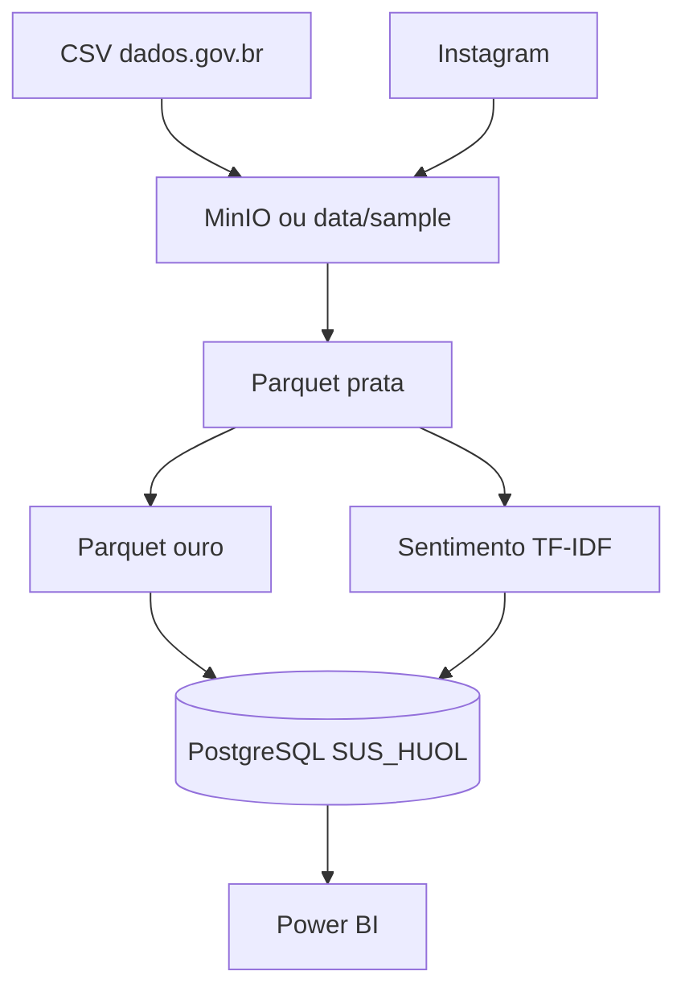

# SUS_HUOL — Data Lake Saúde (HUOL / SUS)

Repositório do **Trabalho AV2** — Sistemas de Apoio à Decisão (UNI7).

Sistema de análise que integra internações SUS (dados estruturados) e comentários do Instagram [@huol_ufrn](https://www.instagram.com/huol_ufrn/) (dados não estruturados) para apoiar a decisão de credenciamento ao SUS de um hospital privado em Natal/RN, usando o HUOL/UFRN como referência regional.

| Item | Valor |
|------|--------|
| **Disciplina** | Sistemas de Apoio à Decisão |
| **Curso** | Sistemas de Informação |
| **Banco PostgreSQL** | **`SUS_HUOL`** (`localhost:5432`, usuário `postgres`) |
| **Repositório** | https://github.com/valterleao/SUS_HUOL |

---

## Execução rápida

```powershell
git clone https://github.com/valterleao/SUS_HUOL.git
cd SUS_HUOL
python -m venv .venv
.\.venv\Scripts\activate
pip install -r requirements.txt
copy .env.example .env
python scripts\run_pipeline.py
```

## Onde colocar os CSV (dados reais)

**Não** use `scripts/data/`. Coloque os arquivos na **raiz do repositório**:

```
SUS_HUOL/
├── data/
│   ├── raw/
│   │   ├── sus/          ← todos os CSV do dados.gov.br (*.csv)
│   │   └── instagram/    ← export de comentários (opcional)
│   └── sample/           ← gerado pelo pipeline (bronze, prata, ouro)
├── scripts/
├── sql/
├── docs/
└── powerbi/
```

1. Baixe os CSV em [dados.gov.br — internações hospitalares](https://dados.gov.br/dados/conjuntos-dados/06-internacoes-hospitalares) (período jan/2024–dez/2025).
2. Copie **todos** os arquivos para `data/raw/sus/`.
3. Execute `python scripts\run_pipeline.py` na raiz do projeto.

O script `01_ingest_sus.py` **concatena todos** os `*.csv` de `data/raw/sus/`. Se a pasta estiver vazia, usa amostra em `data/sample/`.

## Stack e ferramentas

- **Python 3.10+** — pipelines e NLP
- **MinIO** (Docker, opcional) — Data Lake objeto
- **PostgreSQL** — Data Warehouse `SUS_HUOL`
- **Power BI** — dashboard ([guia](powerbi/README_POWERBI.md))

### MinIO (opcional)

```powershell
docker compose -f docker/docker-compose.minio.yml up -d
```

Console: http://localhost:9001 (`minioadmin` / `minioadmin`)

---

# Trabalho AV2 — Resultado e documentação

## 1. Introdução e contexto

Um hospital privado de Natal (RN) avalia credenciar-se ao SUS para ofertar internações hospitalares. Antes dessa decisão, a direção precisa compreender **padrões de demanda** no Hospital Universitário Onofre Lopes (HUOL/UFRN) — referência regional já credenciada — e a **percepção da população** nas redes sociais.

A solução combina:

- **Dados estruturados:** internações (portal dados.gov.br, 2024–2025);
- **Dados não estruturados:** comentários públicos no Instagram @huol_ufrn.

Arquitetura **Data Lake** (bronze → prata → ouro) + **Data Warehouse** dimensional no PostgreSQL **`SUS_HUOL`** + visualização no **Power BI**.

Fluxo SAD: **dados brutos → informação tratada → conhecimento analítico → apoio à decisão**.

---

## 2. Perguntas de negócio e respostas

| # | Pergunta | View / artefato | Resposta (dados reais carregados) |
|---|----------|-----------------|-----------------------------------|
| 1 | Especialidades com mais internações? | `olap.vw_top_especialidades` | **Cardiologia** (1.253), Urologia (1.185), Cirurgia Geral (932) |
| 2 | Perfil etário e gênero? | `olap.vw_perfil_paciente` | Destaque **60+** (~37% do total); equilíbrio relativo entre sexos |
| 3 | Padrão por município? | `olap.vw_internacoes_municipio` | **Natal** concentra ~35%; demais municípios do RN e interior |
| 4 | Sazonalidade 2024–2025? | `olap.vw_sazonalidade_mensal` | Volume mensal entre ~526 e ~770 internações, sem picos extremos |
| 5 | O que dizem sobre o hospital? | `olap.vw_comentarios_amostra`, `olap.vw_termos_frequentes` | Temas: atendimento, equipe, emergência, pediatria, estrutura, SUS |
| 6 | Sentimento no Instagram? | `olap.vw_sentimento_distribuicao` | **Positivo 44%**, neutro 32%, negativo 24% |

---

## 3. Fontes de dados

### 3.1 Internações SUS

- **Fonte:** [Conjunto 06 — Internações hospitalares](https://dados.gov.br/dados/conjuntos-dados/06-internacoes-hospitalares) (conta gov.br).
- **Execução:** 8 arquivos CSV em `data/raw/sus/` → **15.884 linhas** brutas → **13.964** após filtro 2024–2025.
- **Colunas gov.br:** `data_internacao`, `especialidade`, `município`, `idade`, `sexo` (encoding `latin-1`, separador `;`).
- **CNES HUOL (referência):** `2338179`.

### 3.2 Instagram

- **Perfil:** @huol_ufrn.
- **Preferencial:** Instagram Graph API (variáveis em `.env`).
- **Utilizado:** coleta manual / amostra (`data/sample/instagram_comentarios_huol.csv`, 25 comentários).
- **Limitação:** amostra pequena; sentimento é **indicativo**, não representativo da população.

---

## 4. Arquitetura



| Camada | Conteúdo |
|--------|----------|
| Bronze | CSV bruto + metadados (`01_ingest_sus.py`, `02_ingest_instagram.py`) |
| Prata | Padronização, faixas etárias, capital/interior (`03_bronze_to_silver.py`) |
| Ouro | Agregações e base de sentimento (`04_`, `05_`) |
| DW | `staging` + `olap` no banco **`SUS_HUOL`** (`06_load_postgres.py`) |

Se MinIO não estiver ativo, o pipeline grava em `data/sample/` (fallback documentado).

---

## 5. Data Lake — transformações

| Regra (SUS) | Detalhe |
|-------------|---------|
| Encoding | `latin-1` (gov.br) / `utf-8-sig` (bronze gerado) |
| Colunas | `especialidade` → `especialidade_hospitalar`; `município` → `municipio_residencia` |
| Internações | 1 linha = 1 internação (`numero_internacoes = 1`) |
| Faixas etárias | 0–17, 18–39, 40–59, 60+ |
| Município | Flag Capital (Natal) vs Interior |
| Período | Apenas anos **2024 e 2025** |

**Instagram (prata):** remoção de URLs, menções e hashtags; `texto_original` + `texto_limpo`; deduplicação por `comment_id`.

---

## 6. Data Warehouse (`SUS_HUOL`)

### Modelo estrela

- `olap.dim_tempo`, `dim_especialidade`, `dim_paciente`, `dim_municipio`
- `olap.fato_internacao` — medida `qtd_internacoes`
- `olap.fato_sentimento_comentario` — grão por comentário

**Grão da fato:** data × especialidade × perfil × município de residência.

**Scripts SQL:** `sql/01_staging.sql`, `03_criar_modelo_olap.sql`, `04_criar_views_dashboard.sql`, `05_termos_instagram.sql`.

---

## 7. Análises estruturadas (13.964 internações)

### 7.1 Especialidades (Q1)

| Ranking | Especialidade | Total |
|--------:|---------------|------:|
| 1 | Cardiologia | 1.253 |
| 2 | Urologia | 1.185 |
| 3 | Cirurgia Geral | 932 |
| 4 | Gastroenterologia | 868 |
| 5 | Clínica Geral | 817 |

**Insight:** demanda forte em **áreas clínicas e cirúrgicas de alta complexidade**; credenciamento exige portfólio amplo, não só procedimentos eletivos.

### 7.2 Perfil etário e gênero (Q2)

| Faixa | Sexo | Internações | % |
|-------|------|------------:|--:|
| 60+ | Masculino | 2.791 | 20,0% |
| 60+ | Feminino | 2.396 | 17,2% |
| 40–59 | Feminino | 2.318 | 16,6% |
| 40–59 | Masculino | 2.012 | 14,4% |

**Insight:** público **adulto e idoso** predominante; planejar leitos e equipe para geriatria e crônicos.

### 7.3 Municípios (Q3)

| Município | Tipo | Internações | % |
|-----------|------|------------:|--:|
| Natal | Capital | 4.863 | 34,8% |
| Parnamirim | Interior | 1.048 | 7,5% |
| São Gonçalo do Amarante | Interior | 378 | 2,7% |
| Macaíba | Interior | 363 | 2,6% |

**Insight:** HUOL é referência para **Natal e região metropolitana/interior**; hospital privado credenciado atenderia fluxo regional semelhante.

### 7.4 Sazonalidade (Q4)

Exemplos mensais: jan/2024 (538), abr/2024 (652), jul/2025 (770), set/2025 (748). Variação moderada, sem sazonalidade extrema.

**Insight:** demanda **estruturalmente contínua** — planejamento de capacidade deve ser permanente.

---

## 8. Análises não estruturadas (Instagram)

| Etapa | Técnica |
|-------|---------|
| Limpeza | Regex, remoção de ruído (`transforms.py`) |
| Tokenização | NLTK |
| Sentimento | Léxico PT + regras (`05_sentiment_analysis.py`) |
| Termos | TF-IDF por classe |

| Sentimento | Qtd. | % |
|------------|-----:|--:|
| Positivo | 11 | 44,0% |
| Neutro | 8 | 32,0% |
| Negativo | 6 | 24,0% |

**Insight:** percepção majoritariamente favorável, com **24% negativa** (espera, estrutura, organização).

---

## 9. Integração e recomendação SAD

| Dimensão | Evidência | Implicação |
|----------|-----------|------------|
| Demanda | 13.964 internações; líder Cardiologia | Capacidade clínica e leitos amplos |
| Abrangência | Natal ~35% + interior RN | Logística regional |
| Percepção | 44% positivo / 24% negativo | Marca pública mitigada, não excelente |
| Gargalos | Espera, estrutura (texto) | Investir em processos antes de credenciar |

**Recomendação:** credenciamento **viável e condicionado** — piloto em 1–2 especialidades (ex.: cirurgia eletiva + obstetrícia), monitorando indicadores no DW `SUS_HUOL`.

---

## 10. Conclusão

Pipeline completo (Data Lake, NLP, DW **`SUS_HUOL`**) integrado aos dados reais do gov.br, respondendo às seis perguntas de negócio e apoiando decisão de credenciamento SUS com evidências quantitativas e qualitativas.

**Próximos passos:** Instagram Graph API contínua; MinIO em produção; validação manual ampliada do sentimento.

---

## 11. Referências

- [Internações hospitalares — dados.gov.br](https://dados.gov.br/dados/conjuntos-dados/06-internacoes-hospitalares)
- [Instagram @huol_ufrn](https://www.instagram.com/huol_ufrn/)
- [Meta Graph API](https://developers.facebook.com/docs/instagram-api/)
- [MinIO](https://min.io/) · [PostgreSQL](https://www.postgresql.org/)

---

## Documentação complementar

| Arquivo | Conteúdo |
|---------|----------|
| [docs/TRABALHO_AV2_SUS_HUOL.md](docs/TRABALHO_AV2_SUS_HUOL.md) | Versão para entrega acadêmica (espelho deste README) |
| [powerbi/README_POWERBI.md](powerbi/README_POWERBI.md) | Conexão e visuais Power BI |
| [Trabalho AV2 DW Saúde.pdf](Trabalho%20AV2%20DW%20Saúde.pdf) | Enunciado da disciplina |

**Estrutura do repositório:** `scripts/` (pipeline), `sql/` (DW), `docker/` (MinIO), `data/raw/sus/` (seus CSV).
