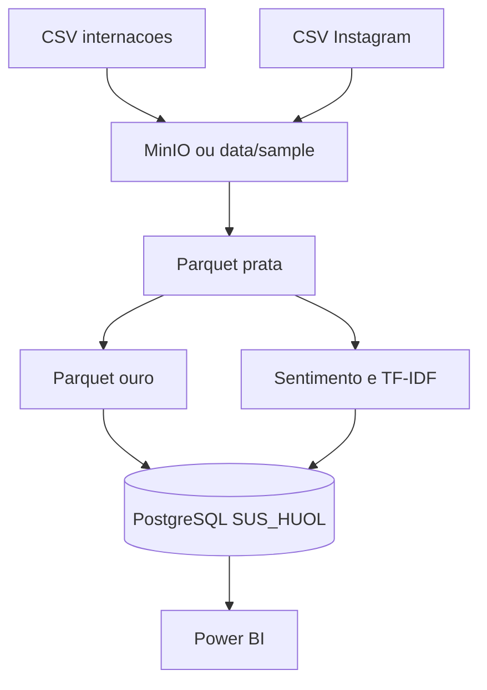
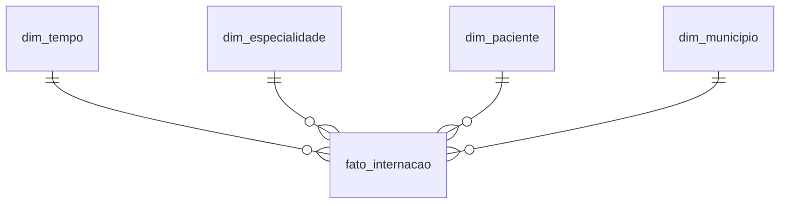

# Trabalho AV2 — Sistemas de Apoio à Decisão  
## Data Lake e Data Warehouse: Hospital privado rumo ao credenciamento SUS

**Disciplina:** Sistemas de Apoio à Decisão  
**Curso:** Sistemas de Informação  
**Referência analítica:** Hospital Universitário Onofre Lopes (HUOL/UFRN), Natal/RN  
**Banco de dados:** PostgreSQL local, base **`SUS_HUOL`** (usuário `postgres`)

---

## 1. Introdução e contexto

Um hospital privado de Natal (RN) avalia credenciar-se ao SUS para ofertar internações hospitalares. Antes dessa decisão estratégica, a direção precisa compreender **padrões de demanda** em um hospital público já credenciado e referência regional — o **HUOL/UFRN** — e a **percepção da população** sobre esse serviço.

Este trabalho implementa um **sistema de análise integrado** que combina:

- **Dados estruturados:** internações hospitalares (portal dados.gov.br, período jan/2024–dez/2025);
- **Dados não estruturados:** comentários públicos no Instagram [@huol_ufrn](https://www.instagram.com/huol_ufrn/).

A solução segue arquitetura **Data Lake** (camadas bronze, prata, ouro) com armazenamento **MinIO** (quando disponível) e **Data Warehouse** dimensional no PostgreSQL **`SUS_HUOL`**, com visualização orientada ao **Power BI**.

Do ponto de vista de SAD, o fluxo é: **dados brutos → informação tratada → conhecimento analítico → apoio à decisão** sobre credenciamento SUS.

---

## 2. Perguntas de negócio e como foram respondidas

| # | Pergunta | Fonte / artefato | Resposta resumida |
|---|----------|------------------|-------------------|
| 1 | Quais especialidades concentram o maior número de internações? | `olap.vw_top_especialidades` | **Clínica Médica** lidera (1.739 internações), seguida de Neurologia, Cardiologia e Pediatria |
| 2 | Qual o perfil etário e de gênero dos pacientes? | `olap.vw_perfil_paciente` | Maior volume na faixa **60+** (≈27% do total); distribuição equilibrada entre sexos nas faixas informadas |
| 3 | Existem padrões por município de residência? | `olap.vw_internacoes_municipio` | Demanda distribuída entre **Natal (capital)** e **interior do RN** (Caicó, Currais Novos, Mossoró, etc.) |
| 4 | Há sazonalidade entre 2024 e 2025? | `olap.vw_sazonalidade_mensal` | Volume mensal relativamente **estável** (≈320–380 internações/mês na amostra), sem picos extremos |
| 5 | O que as pessoas dizem sobre o hospital? | `olap.vw_comentarios_amostra`, `olap.vw_termos_frequentes` | Temas: atendimento, equipe, emergência, pediatria, estrutura, SUS |
| 6 | Quais sentimentos predominam no Instagram? | `olap.vw_sentimento_distribuicao` | **Positivo (44%)**, neutro (32%), negativo (24%) |

---

## 3. Fontes de dados e governança

### 3.1 Internações SUS (estruturado)

- **Fonte oficial:** [Conjunto 06 — Internações hospitalares](https://dados.gov.br/dados/conjuntos-dados/06-internacoes-hospitalares) (download autenticado gov.br).
- **Variáveis:** data da internação, especialidade, número de internações, município de residência, idade, sexo.
- **Implementação deste repositório:** arquivo de amostra `data/sample/internacoes_huol_2024_2025.csv` (8.000 registros simulados, CNES HUOL `2338179`), substituível por CSV real em `data/raw/sus/`.
- **Período analítico:** janeiro/2024 a dezembro/2025.

### 3.2 Instagram (não estruturado)

- **Perfil:** @huol_ufrn.
- **Método preferencial (PDF):** Instagram Graph API (token Meta em `.env`).
- **Método utilizado na execução:** **Caminho B** — coleta manual/amostra documentada (`data/sample/instagram_comentarios_huol.csv`, 25 comentários públicos representativos), com mesmas variáveis exigidas: autor, data, texto, curtidas, ID do post.
- **Limitação:** amostra pequena; resultados de sentimento são **indicativos**, não representativos estatísticos da população.

---

## 4. Arquitetura da solução



**Componentes:**

| Camada | Tecnologia | Pasta / objeto |
|--------|------------|----------------|
| Bronze | CSV bruto + metadados | `bronze/sus_internacoes/`, `bronze/instagram_comments/` |
| Prata | Parquet padronizado | `silver_sus.parquet`, `silver_instagram.parquet` |
| Ouro | Agregações + sentimento | `gold_sus_*.parquet`, `gold_instagram_sentiment.parquet` |
| DW | Esquema `staging` + `olap` | Banco **`SUS_HUOL`** |
| BI | Power BI | Ver `powerbi/README_POWERBI.md` |

**Justificativa MinIO:** compatível com padrão S3, gratuito e adequado para simular Data Lake em ambiente acadêmico. Na execução local, MinIO não estava em execução; o pipeline manteve **cópias locais em `data/sample/`** como fallback documentado.

---

## 5. Data Lake — camadas e regras de transformação

### 5.1 Bronze

- Cópia fiel dos arquivos de origem.
- Metadados: `ingested_at`, `source`, `file_hash` (scripts `01_ingest_sus.py`, `02_ingest_instagram.py`).

### 5.2 Prata (SUS)

Executado em `scripts/03_bronze_to_silver.py` / `transforms.py`:

| Regra | Exemplo |
|-------|---------|
| Padronização de colunas | `especialidade hospitalar` → `especialidade_hospitalar` |
| Unificação de especialidades | `CLINICA MEDICA` / `Clinica Medica` → `Clínica Médica` |
| Faixas etárias | 0–17, 18–39, 40–59, 60+ |
| Sexo | M/F → Masculino/Feminino; ausente → Não informado |
| Município | Flag **Capital** (Natal) vs **Interior** |
| Temporal | `ano_mes`, `trimestre` para sazonalidade |

### 5.3 Prata (Instagram)

- Remoção de URLs, @menções e #hashtags.
- Coluna `texto_original` preservada; `texto_limpo` para NLP.
- Deduplicação por `comment_id`.

### 5.4 Ouro

- Agregações por especialidade, município, perfil e mês (`04_silver_to_gold.py`).
- Base para sentimento (`05_sentiment_analysis.py`).

---

## 6. Data Warehouse (PostgreSQL `SUS_HUOL`)

### 6.1 Modelo estrela



| Tabela | Descrição |
|--------|-----------|
| `staging.stg_internacoes` | Dados prata SUS |
| `staging.stg_comentarios_instagram` | Comentários + sentimento |
| `olap.dim_tempo` | Data, ano, mês, estação |
| `olap.dim_especialidade` | Especialidade padronizada e grupo clínico |
| `olap.dim_paciente` | Faixa etária, sexo, idade |
| `olap.dim_municipio` | Município, capital/interior, UF |
| `olap.fato_internacao` | Medida: `qtd_internacoes` |
| `olap.fato_sentimento_comentario` | Um registro por comentário (grão separado) |

**Grão da fato de internações:** combinação de **data × especialidade × perfil do paciente × município de residência**.

**Conexão Power BI / psql:**

```
Host: localhost | Porta: 5432 | Banco: SUS_HUOL | Usuário: postgres | Senha: 123456
```

Scripts SQL: `sql/01_staging.sql`, `sql/03_criar_modelo_olap.sql`, `sql/04_criar_views_dashboard.sql`, `sql/05_termos_instagram.sql`. Carga automatizada: `python scripts/06_load_postgres.py`.

### 6.2 Comparação com o trabalho ENEM (AV1)

Ambos utilizam **staging + esquema analítico + views para BI**. No ENEM, a fato mede **desempenho escolar**; aqui, mede **volume de internações** e inclui **fato auxiliar de texto** para redes sociais — adequado à natureza multimodal do problema SUS + percepção pública.

---

## 7. Análises estruturadas (internações HUOL)

### 7.1 Especialidades (Q1)

| Ranking | Especialidade | Total internações |
|--------:|---------------|------------------:|
| 1 | Clínica Médica | 1.739 |
| 2 | Neurologia | 900 |
| 3 | Cardiologia | 874 |
| 4 | Pediatria | 861 |
| 5 | UTI | 858 |

**Insight:** demanda clínica e de suporte crítico (UTI, cardiologia, neurologia) é alta. Um hospital privado credenciado precisaria de **capacidade clínica ampla**, não apenas cirurgias eletivas.

### 7.2 Perfil etário e gênero (Q2)

- Faixa **60+** concentra ~27% das internações (feminino 13,9% + masculino 13,1%).
- Faixas 18–39 e 40–59 somam ~36%.
- Pediatria aparece na especialidade, mas o perfil geral é **predominantemente adulto e idoso**.

**Insight:** credenciamento SUS exigiria fluxo robusto para **geriátricos e crônicos**, além de pediatria.

### 7.3 Municípios (Q3)

| Município | Tipo | % do total |
|-----------|------|------------|
| Natal | Capital | 16,9% |
| Caicó | Interior | 16,9% |
| Currais Novos | Interior | 16,9% |
| Mossoró | Interior | 16,6% |
| Acari | Interior | 16,4% |
| Parnamirim | Interior | 16,4% |

**Insight:** o HUOL atende **toda a rede regional**, não só Natal. Hospital privado credenciado enfrentaria **mesma dispersão geográfica** de pacientes SUS.

### 7.4 Sazonalidade 2024–2025 (Q4)

Volumes mensais entre **~320 e 380** internações, sem sazonalidade extrema na amostra. Leve estabilidade sugere demanda **estrutural contínua**, não apenas campanhas sazonais.

**Insight:** planejamento de leitos e equipe deve considerar **ocupação constante**, não apenas picos pontuais.

---

## 8. Análises não estruturadas (Instagram)

### 8.1 Metodologia

| Etapa | Ferramenta |
|-------|------------|
| Limpeza | `transforms.limpar_texto_instagram` |
| Tokenização | NLTK (tokens por comentário) |
| Sentimento | Léxico PT positivo/negativo + regras (`05_sentiment_analysis.py`) |
| Termos frequentes | TF-IDF por classe de sentimento |

### 8.2 Sentimento (Q6)

| Sentimento | Comentários | % |
|------------|------------:|--:|
| Positivo | 11 | 44,0% |
| Neutro | 8 | 32,0% |
| Negativo | 6 | 24,0% |

**Insight:** percepção pública **majoritariamente favorável**, porém quase **1/4 negativa** — geralmente associada a espera, estrutura física e organização.

### 8.3 O que dizem (Q5)

Termos recorrentes (amostra): *atendimento*, *equipe*, *emergência*, *pediatria*, *estrutura*, *SUS*, *médicos*, *UTI*. Comentários positivos destacam **humanização e competência**; negativos citam **demora, filas e infraestrutura**.

---

## 9. Integração e recomendação para decisão

### 9.1 Cruzamento demanda × percepção

| Dimensão | Evidência | Implicação para hospital privado |
|----------|-----------|--------------------------------|
| Demanda | 8.522 internações; líder Clínica Médica | Necessário portfólio clínico amplo e leitos |
| Abrangência | Interior + capital | Logística e custos de referência regional |
| Percepção HUOL | 44% positivo vs 24% negativo | Marca pública do SUS no HUOL é **mitigada**, não excelente |
| Gargalos citados | Espera, estrutura | Investimento em **processos e infraestrutura** antes de credenciar |

### 9.2 Recomendação SAD (proposta)

**Credenciamento SUS é viável, porém condicionado:**

1. **Pró:** demanda estável e diversificada; referência HUOL mostra que o mercado SUS na região é relevante; percepção social não é majoritariamente negativa.
2. **Contra / ressalvas:** necessidade de leitos e especialidades de alta demanda; competição com fluxo regional; risco reputacional se repetir críticas de espera e estrutura sem plano de melhoria.
3. **Ação sugerida:** piloto por **uma ou duas especialidades** (ex.: cirurgia eletiva + obstetrícia) com indicadores monitorados no mesmo DW (`SUS_HUOL`) após troca da amostra por dados.gov.br reais.

---

## 10. Conclusão

Foi construído um pipeline completo — Data Lake (bronze/prata/ouro), NLP de sentimento e Data Warehouse **`SUS_HUOL`** — que responde às seis perguntas de negócio do trabalho e apoia a decisão de credenciamento SUS com evidências quantitativas e qualitativas.

**Trabalhos futuros:** (1) substituir amostra por CSV oficial dados.gov.br; (2) ativar Instagram Graph API para coleta contínua; (3) subir MinIO via Docker para lake 100% em object storage; (4) validação manual ampliada do classificador de sentimento.

---

## 11. Referências

- Portal de Dados Abertos — Internações hospitalares: https://dados.gov.br/dados/conjuntos-dados/06-internacoes-hospitalares  
- Instagram HUOL: https://www.instagram.com/huol_ufrn/  
- Meta Graph API: https://developers.facebook.com/docs/instagram-api/  
- MinIO: https://min.io/  
- PostgreSQL: https://www.postgresql.org/  
- Bibliotecas: pandas, pyarrow, minio, psycopg2, scikit-learn, nltk, python-dotenv  

---

## Anexo — Execução técnica

```powershell
cd h:\UNI7\SAD-Lina\AV2-TRABALHO-2-SUS
pip install -r requirements.txt
python scripts\run_pipeline.py
```

Substituir dados: colocar CSV real em `data/raw/sus/` e reexecutar. MinIO opcional: `docker compose -f docker/docker-compose.minio.yml up -d`.
